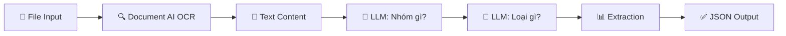
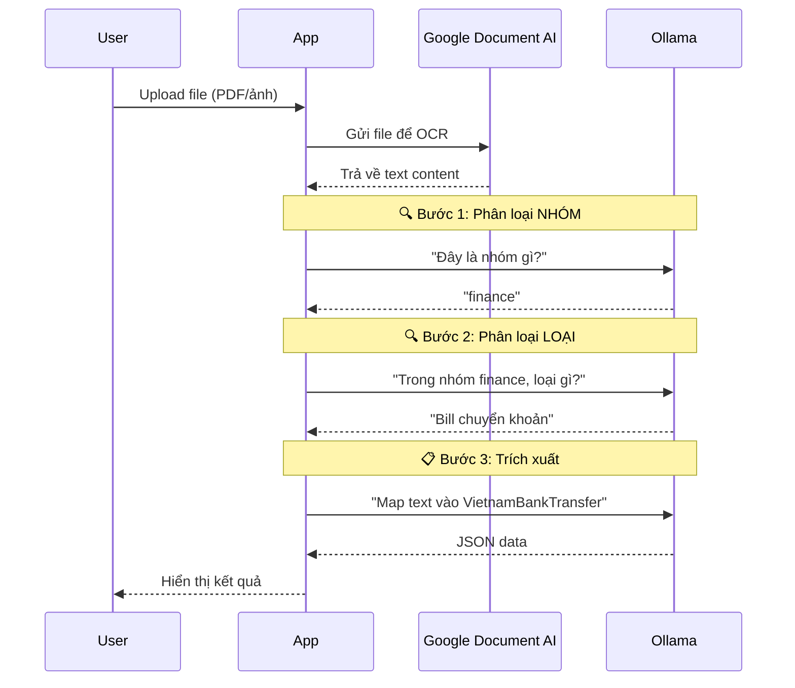

# Giải thích Pipeline Xử lý Văn bản (2-Level Classification)

## Tổng quan Kiến trúc



## Các Thành phần Chính

| Thành phần | Công nghệ | Mô tả |
|------------|-----------|-------|
| **OCR** | Google Document AI | Đọc text từ ảnh/PDF (Cloud) |
| **LLM** | Ollama (qwen2.5:3b) | 2-level phân loại + Trích xuất (Local) |
| **Framework** | ExtractThinker | Kết nối OCR ↔ LLM |

---

## Chi tiết Pipeline (3 Bước)

### Bước 1: Phân loại NHÓM
```python
category_result = extractor.classify(file_path, self.category_classifications)
# LLM hỏi: "Đây là giấy tờ thuộc nhóm nào?"
# → Trả lời: "finance" (tài chính)
```
**Các nhóm:**
- `identity` - Giấy tờ tùy thân
- `vehicle` - Giấy tờ phương tiện  
- `finance` - Giấy tờ tài chính

### Bước 2: Phân loại LOẠI cụ thể
```python
doc_result = extractor.classify(file_path, doc_classifications)
# LLM hỏi: "Trong nhóm finance, đây là loại gì?"
# → Trả lời: "Bill chuyển khoản"
```
**Ví dụ các loại trong nhóm `finance`:**
- Hợp đồng → `VietnamContract`
- Bill chuyển khoản → `VietnamBankTransfer`

### Bước 3: Trích xuất thông tin
```python
extracted = extractor.extract(file_path, contract)
# LLM map text vào các trường của Contract
# → JSON output với các field đã định nghĩa
```

---

## Luồng Dữ liệu



---

## Ví dụ Output

**Input:** Ảnh bill chuyển khoản VPBank

**Output:**
```json
{
    "classification": "Bill chuyển khoản",
    "category": "finance",
    "confidence": 9,
    "data": {
        "trang_thai": "Giao dịch thành công",
        "so_tien": "41,000 VND",
        "ten_nguoi_chuyen": "LE XUAN AN",
        "ten_nguoi_nhan": "CTY CP T-MARTSTORES",
        "ma_giao_dich": "030V600253564373"
    }
}
```

---

## Các loại Văn bản Hỗ trợ

| Nhóm | Code | Loại hỗ trợ |
|------|------|-------------|
| 🪪 **identity** | Tùy thân | CCCD, Hộ chiếu, Giấy khai sinh |
| 🚗 **vehicle** | Phương tiện | Bằng lái, Đăng ký xe, Đăng kiểm |
| 💰 **finance** | Tài chính | Hợp đồng, Bill chuyển khoản |
